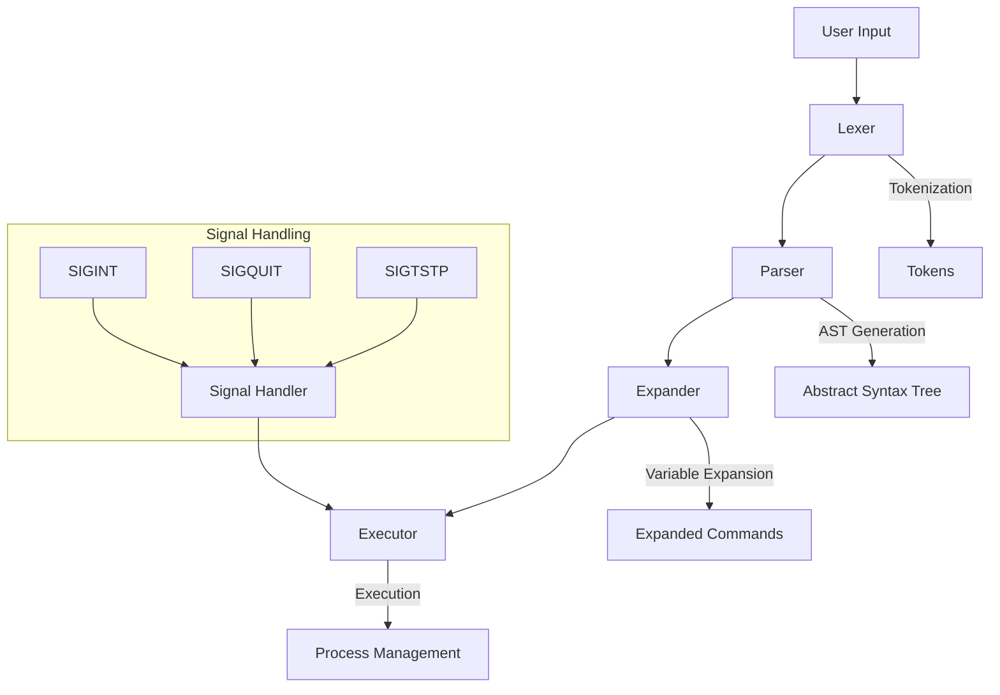
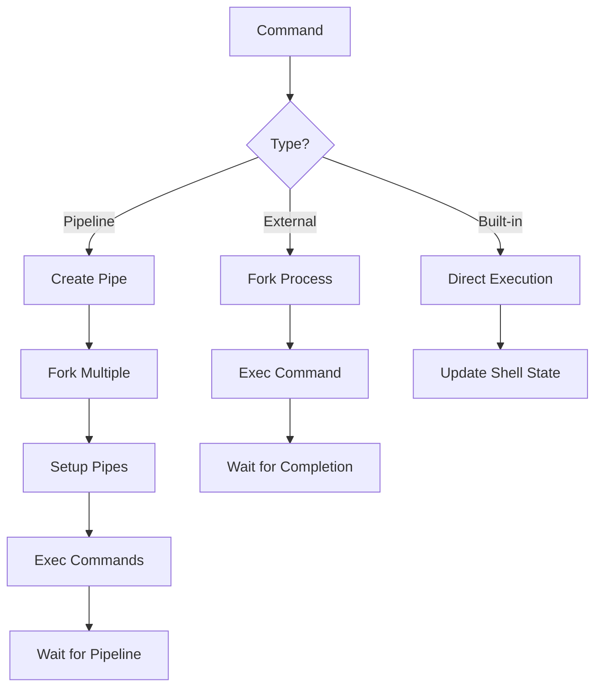
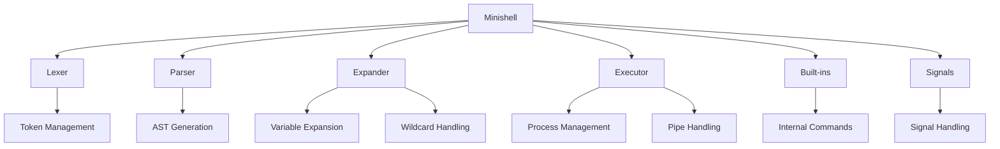
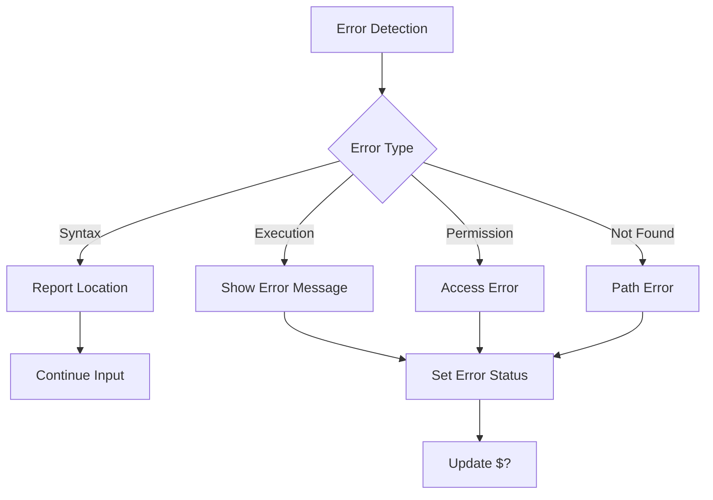
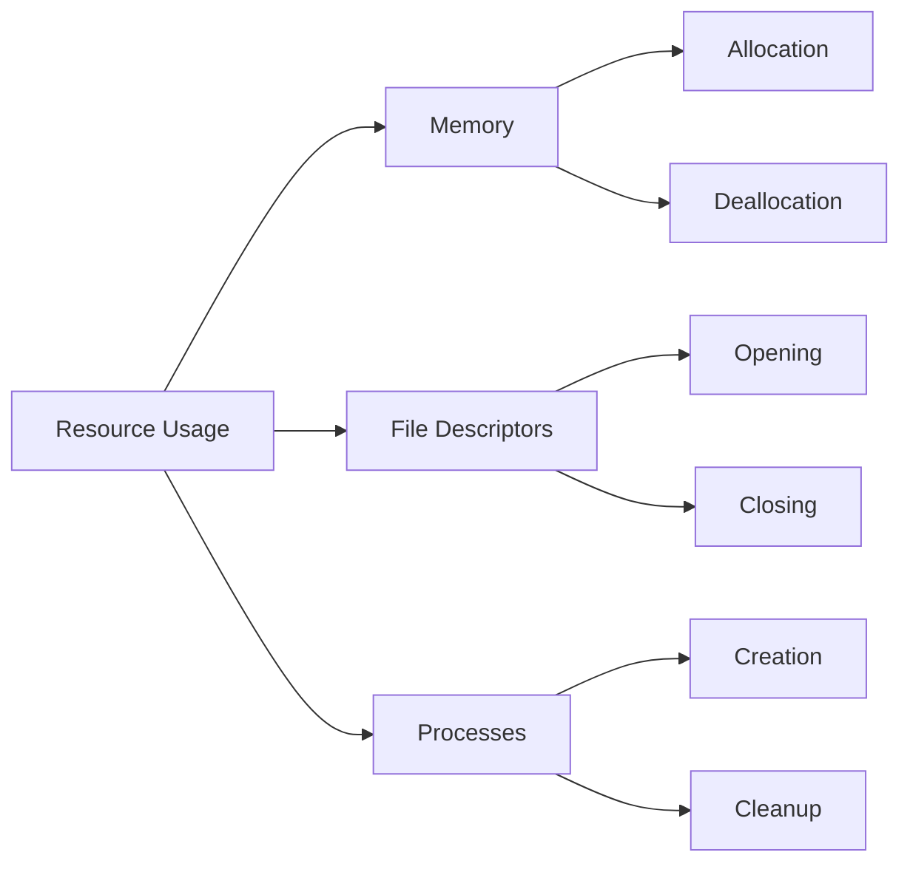

# Minishell - A Custom Shell Implementation

> "Built with a love for coding and a serious beef with error handling… pretty sure I can C now. - YoTi"

## Table of Contents
- [Minishell Overview](#overview)
- [Component Documentation](#component-documentation)
  - [Builtin Commands](src/builtin/README.md)
  - [Environment Management](src/env/README.md)
  - [Execution System](src/execution/README.md)
  - [Expander Module](src/expander/README.md)
  - [Here-Document Handler](src/here-doc/README.md)
  - [Lexical Analyzer](src/lexer/README.md)
  - [Parser System](src/parser/README.md)
  - [Signal Handler](src/signals/README.md)
  - [Main Core](src/main/README.md)

## Overview
Minishell is a custom implementation of a Unix shell, designed to replicate core functionalities of bash. This project demonstrates advanced system programming concepts including process management, signal handling, parsing, and command execution.

## Architecture


## Features

### Command Processing Pipeline


### Command Types and Execution Flow


### Built-in Commands
- `echo` with `-n` option
- `cd` with relative or absolute path
- `pwd` without options
- `export` for environment variables
- `unset` to remove variables
- `env` to display environment
- `exit` with exit status

### Advanced Features
- Command history navigation
- Syntax error handling
- Quote handling (single and double)
- Environment variable management
- Working directory tracking
- Custom prompt display

## Project Structure

### Component Overview


### Directory Structure
```
src/
├── lexer/      - Tokenization and lexical analysis
├── parser/     - Command parsing and AST generation
├── expander/   - Variable and wildcard expansion
├── execution/  - Command execution and process management
├── env/        - Environment variable handling
├── builtin/    - Built-in command implementation
├── signals/    - Signal handling and management
├── here-doc/   - Here-document implementation
└── main/       - Shell initialization and main loop
```

## Error Handling

### Error Types and Handling Flow


The shell handles various error cases:
- Syntax errors in command input
- Command not found in PATH
- Permission denied for execution
- Invalid redirections or pipes
- Memory allocation failures
- Signal interruptions

## Requirements

### Build Requirements
- GCC compiler
- Make build system
- Readline library
- POSIX-compliant system

### Installation
```bash
# Install readline if not present
sudo apt-get install libreadline-dev  # For Debian/Ubuntu
sudo yum install readline-devel       # For RHEL/CentOS

# Build the project
make
```

## Usage Examples

### Basic Command Execution
```bash
# Start the shell
./minishell

# Basic commands
$ echo "Hello, World!"
$ ls -l | grep ".c" > output.txt

# Here-document
$ cat << EOF > file.txt
heredoc content
EOF
```

### Environment Variable Management
```bash
# Set and export variables
$ export NAME=value
$ echo $NAME

# Unset variables
$ unset NAME

# Append to PATH
$ export PATH+=:/new/path
```

### Working with Built-ins
```bash
# Directory navigation
$ cd /path/to/dir
$ pwd

# Environment display
$ env

# Shell exit
$ exit 42
```

## Performance Considerations

### Resource Management


- Efficient memory management
- Proper file descriptor handling
- Process cleanup and zombie prevention
- Signal handling optimization
- Command history management

## Development Guidelines

### Code Organization
- Modular component design
- Clear separation of concerns
- Consistent error handling
- Documentation standards
- Unit test coverage

### Best Practices
- Memory leak prevention
- Error propagation
- Signal safety
- Resource cleanup
- Security considerations
