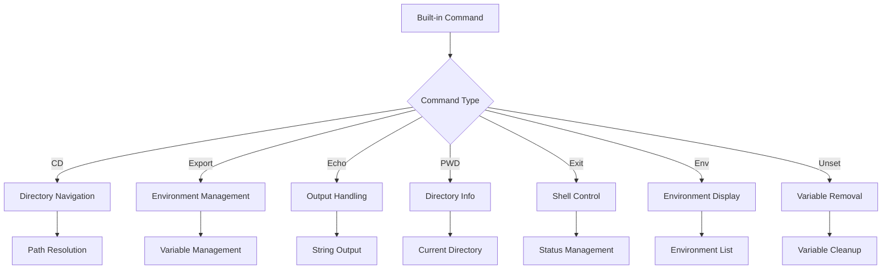
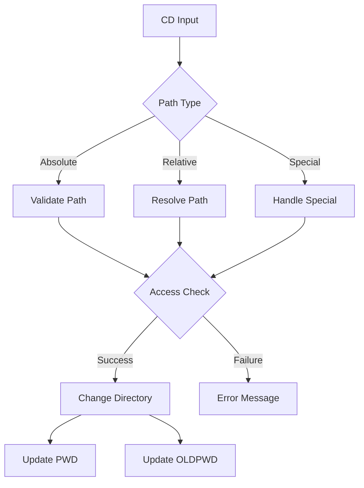
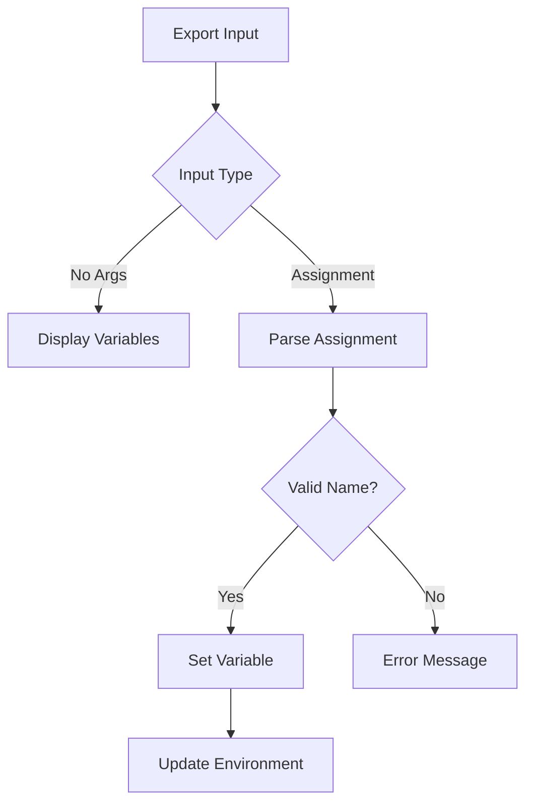
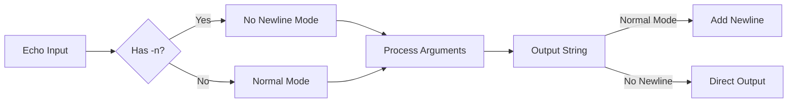
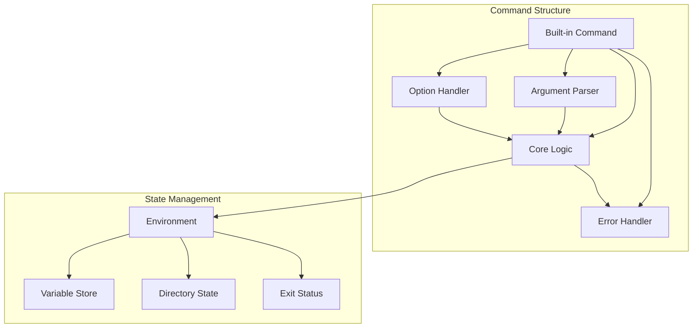
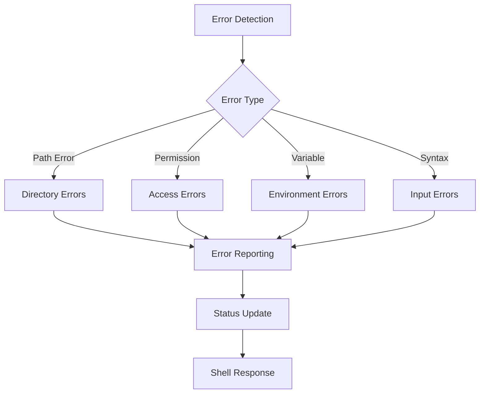
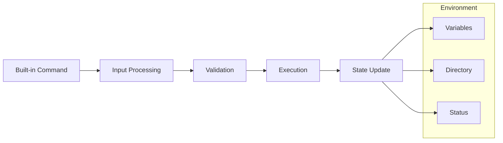
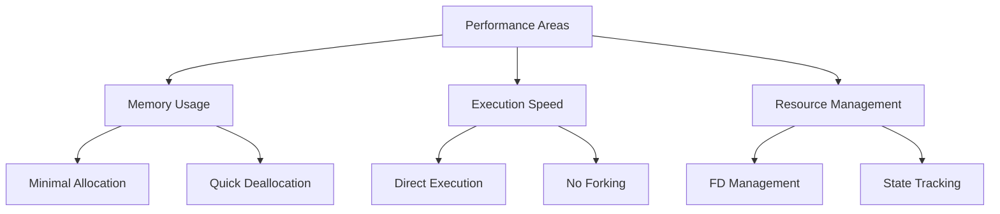
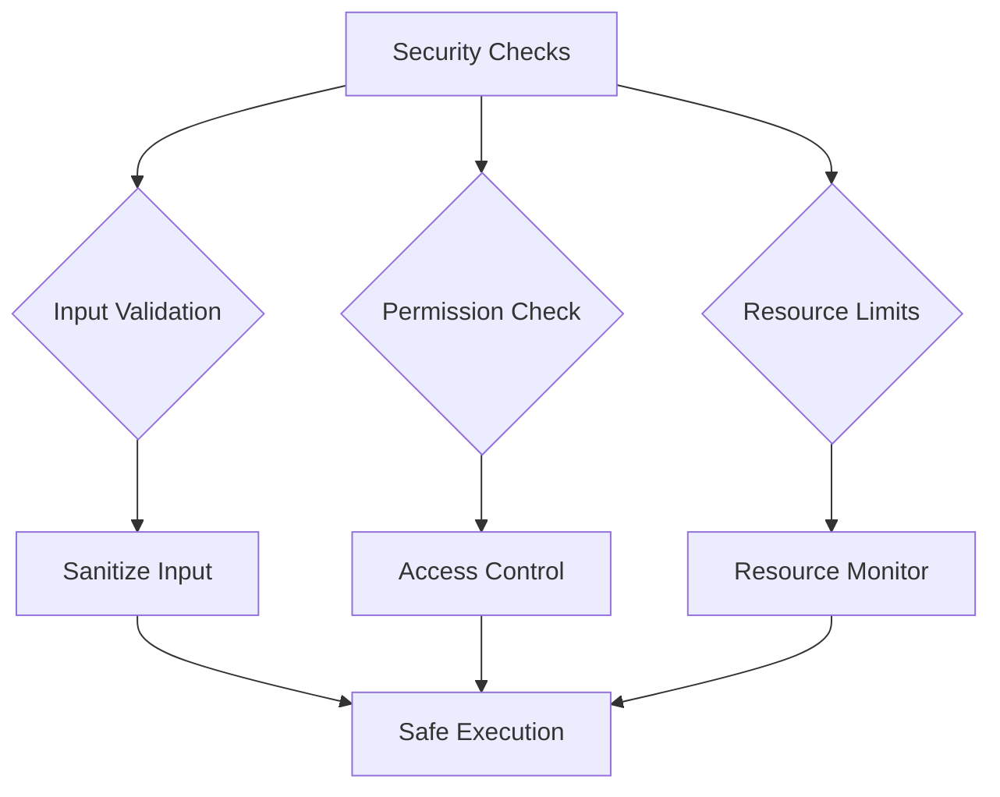
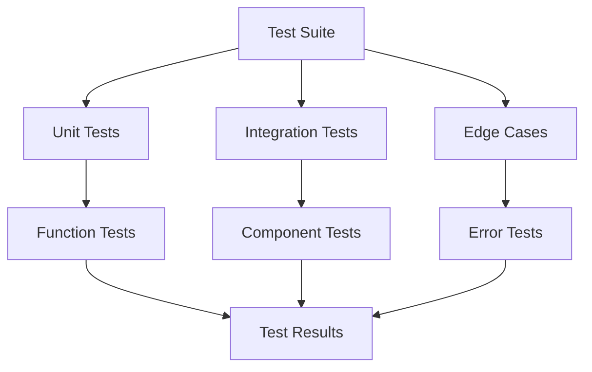

# Built-in Commands Implementation

## Architecture Overview



## Command Flow Diagrams

### CD Command Flow


### Export Command Flow


### Echo Command Flow


## Implementation Details

### Command Components


## Directory Structure
```
builtin/
├── builtin_dispatcher.c # Command identification
├── cd/
│   ├── ft_cd.c        # CD implementation
│   └── ft_cd_helpers.c # Path resolution helpers
├── echo/
│   └── ft_echo.c      # Echo implementation
├── env/
│   └── ft_env.c       # Environment display
├── export/
│   ├── ft_export.c    # Export implementation
│   └── ft_export_helpers.c
├── pwd/
│   └── ft_pwd.c       # PWD implementation
├── unset/
│   └── ft_unset.c     # Unset implementation
└── exit/
    └── ft_exit.c      # Exit implementation
```

## Error Handling System



### Error Categories

#### Directory Operations
- Not found: Directory doesn't exist
- Permission denied: Insufficient access rights
- Not a directory: Path points to non-directory
- Path resolution: Invalid path components

#### Environment Management
- Invalid identifiers: Malformed variable names
- Read-only variables: Attempt to modify protected vars
- Memory allocation: Resource exhaustion
- Duplicate variables: Name conflicts

#### Command Processing
- Invalid arguments: Wrong parameter format
- Missing arguments: Required parameters absent
- Too many arguments: Excess parameters
- Syntax errors: Malformed command structure

## Integration Flow



## Usage Examples

### Directory Navigation
```bash
# Basic navigation
cd /path/to/dir  # Absolute path
cd ..            # Parent directory
cd ~            # Home directory
cd -            # Previous directory
pwd             # Show current path
```

### Environment Management
```bash
# Variable operations
export PATH=/usr/bin          # Set
export PATH+=:/new/path      # Append
unset PATH                   # Remove
env                         # Display all

# Multiple operations
export A=1 B=2              # Multiple exports
unset A B                   # Multiple unsets
```

### Shell Control
```bash
# Exit variations
exit            # Normal exit
exit 42         # Exit with status
exit $?         # Exit with last status
```

## Performance Optimization



### Optimization Strategies
- Minimize memory allocations
- Efficient string handling
- Quick variable lookup
- Smart path resolution
- State caching when beneficial

## Security Model



### Security Measures
- Input validation and sanitization
- Path traversal prevention
- Environment isolation
- Resource usage limits
- Error containment

## Testing Framework



### Test Categories
- Normal operations
- Error conditions
- Edge cases
- Resource management
- Integration scenarios
- Performance metrics
