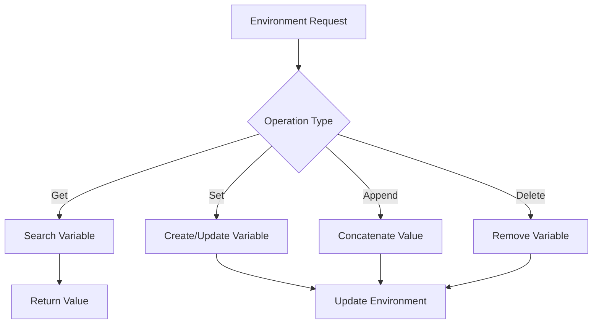

# Environment Module

## Overview
The environment module manages shell environment variables, providing functionality for creating, modifying, searching, and maintaining the environment variable list. It handles variable expansion, concatenation, and special variables like SHLVL.

## Components

### Main Components
1. `env.c` - Core environment functionality
2. `env_2.c` - Environment variable creation and modification
3. `env_3.c` - Environment variable manipulation and special handling
4. `env_lists.c` - Environment linked list operations

## Data Structures

### Environment Variable Node
```c
typedef struct s_env {
    char            *key;           // Variable name
    char            *value;         // Variable value
    int             equal_sign;     // Whether variable has '=' sign
    struct s_env    *prev;          // Previous node
    struct s_env    *next;          // Next node
} t_env;
```

## Flow Diagram


## Features

### 1. Variable Operations
```bash
# Setting variables
KEY=value
KEY="quoted value"

# Appending values
KEY+=append_value

# Unsetting variables
unset KEY
```

### 2. Special Variables
```bash
# Shell level
SHLVL        # Automatically managed

# Last command
$_           # Updated after each command

# Default PATH
PATH         # Set to default if not present
```

## Edge Cases Handled

1. **Variable Creation**
   - Empty variables
   - Quoted values
   - Special characters
   - Invalid names
   - Duplicate variables

2. **Variable Modification**
   - Append operation
   - Value overwrite
   - Unset handling
   - Export handling
   - Concatenation

3. **Special Cases**
   - SHLVL management
   - PATH initialization
   - Empty environment
   - Invalid values
   - Memory management

4. **Error Handling**
   - Memory allocation
   - Invalid names
   - Null values
   - List corruption
   - Circular references

## Example Usage

1. **Basic Operations**
```bash
# Setting variables
USER=john
HOME=/home/john

# Appending values
PATH+=":/new/path"

# Reading variables
echo $USER
echo $HOME
```

2. **Special Handling**
```bash
# SHLVL management
echo $SHLVL    # Increments on new shell

# PATH handling
unset PATH     # Sets to default path

# Last command
echo $_        # Shows last argument
```

## Integration Points

1. **Input Sources**
   - Initial environment
   - Command line
   - Script variables
   - System calls

2. **Output Usage**
   - Command execution
   - Variable expansion
   - Child processes
   - Builtin commands

## Performance Considerations

1. **Memory Management**
   - Efficient allocation
   - Proper deallocation
   - String duplication
   - List maintenance

2. **Search Optimization**
   - Fast lookup
   - Sorted storage
   - Hash table potential
   - Cache usage

3. **String Operations**
   - Minimal copying
   - Efficient concatenation
   - Memory reuse
   - Buffer management

## Error Handling

1. **Input Validation**
   - Variable names
   - Value format
   - Special characters
   - Size limits

2. **Memory Errors**
   - Allocation failures
   - List corruption
   - String operations
   - Cleanup handling

3. **Special Cases**
   - Empty environment
   - System variables
   - Protected variables
   - Readonly variables

## Implementation Details

1. **Variable Storage**
   - Doubly linked list
   - Key-value pairs
   - Equal sign flag
   - Sorted order

2. **Memory Management**
   - String duplication
   - Node allocation
   - List maintenance
   - Cleanup routines

3. **Special Handling**
   - SHLVL increment
   - PATH initialization
   - Last command tracking
   - Export status 