# Execution Module

## Architecture Overview

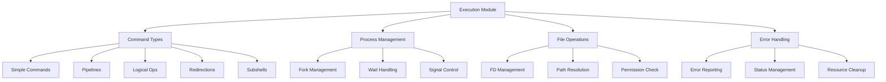

## Process Management Flow

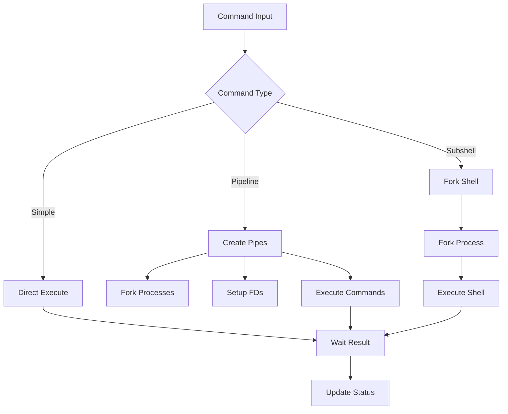

## Components

### Main Files
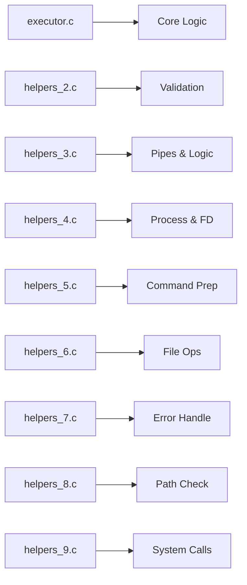

### File Descriptions
1. `executor_core.c` - Core execution engine
2. `command_executor.c` - Command execution handling
3. `pipeline_executor.c` - Pipeline execution
4. `process_manager.c` - Process management
5. `execution_utils.c` - Execution utilities
6. `file_operations.c` - File handling
7. `pipe_operations.c` - Pipe management
8. `redirection_handler.c` - Redirection handling
9. `environment_setup.c` - Environment setup
10. `cleanup_operations.c` - Resource cleanup

## Execution Types

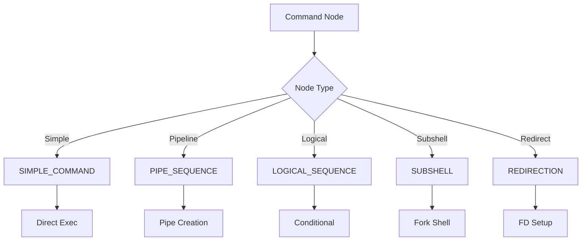

### Implementation Details
```c
enum execution_type {
    SIMPLE_COMMAND,    // Direct execution
    PIPE_SEQUENCE,     // Multiple piped commands
    LOGICAL_SEQUENCE,  // AND/OR operations
    SUBSHELL,         // Nested shell execution
    REDIRECTION       // I/O redirection
};
```

## Pipeline Implementation

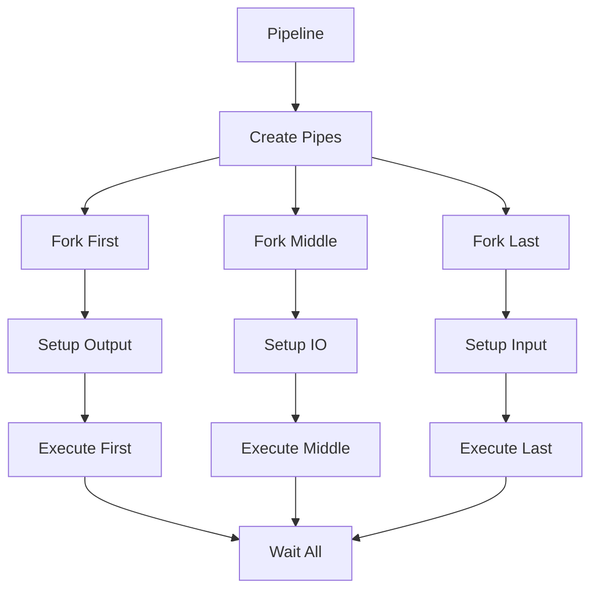

## Error Handling System

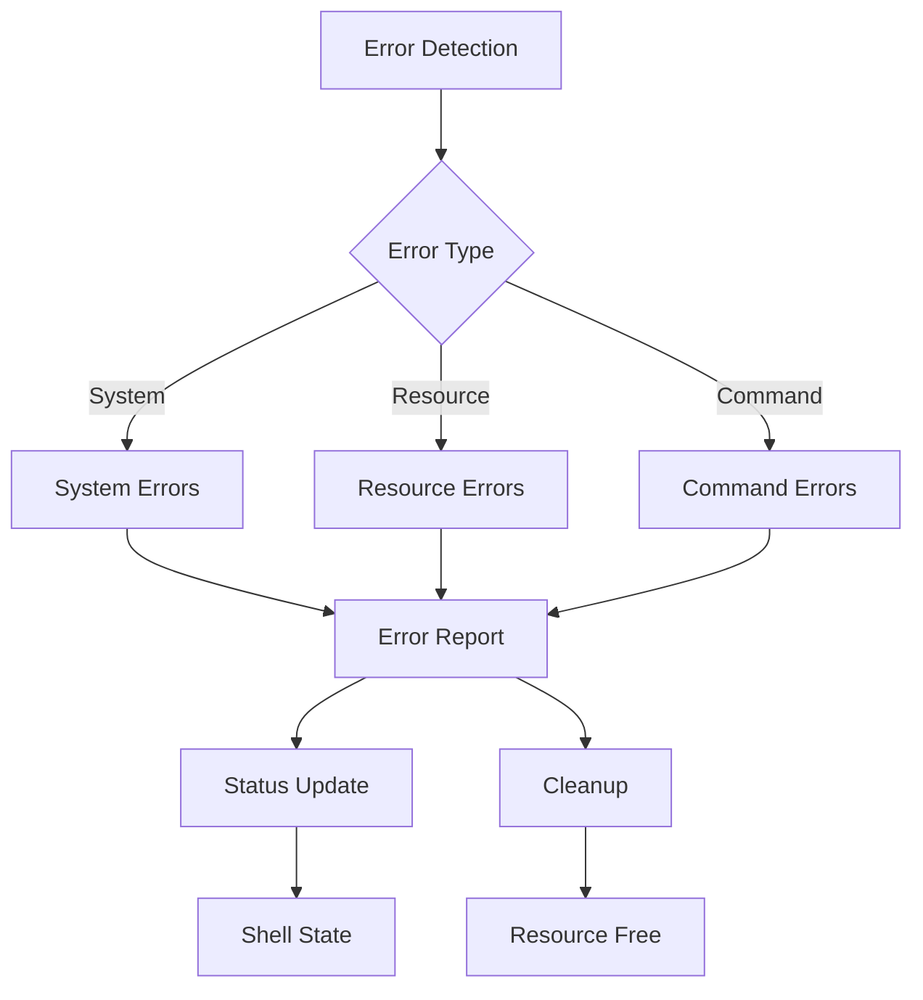

### Error Categories

#### System Errors
- Fork failures
- Memory allocation
- File operations
- Process creation

#### Resource Errors
- File descriptor exhaustion
- Process limit reached
- Memory limit reached
- Pipe creation failure

#### Command Errors
- Command not found
- Permission denied
- Invalid arguments
- Directory execution

## File Descriptor Management

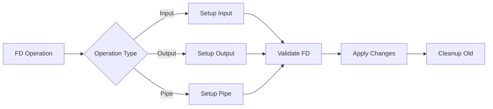

## Signal Handling

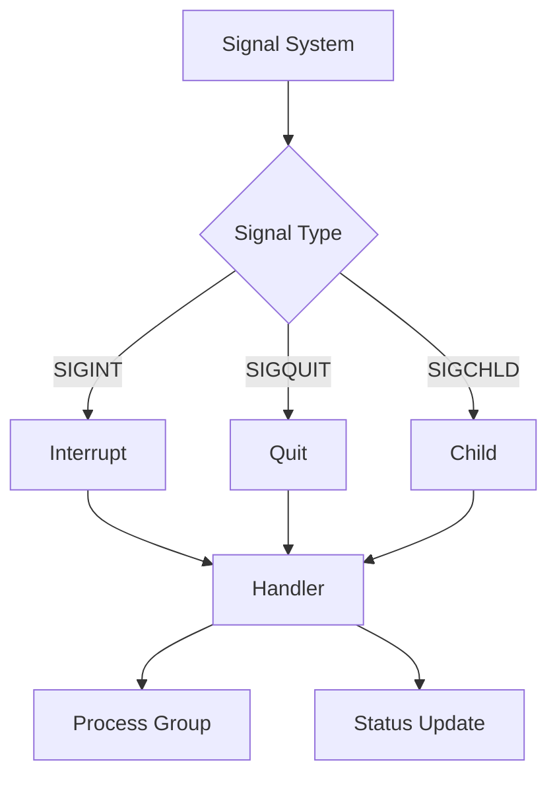

## Performance Optimization

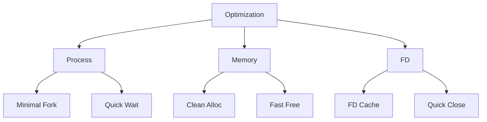

### Optimization Areas
1. Process Management
   - Minimal forking
   - Efficient pipe usage
   - Quick process cleanup
   - Group management

2. Memory Operations
   - Clean allocations
   - Fast deallocations
   - Minimal copying
   - Buffer management

3. File Operations
   - FD caching
   - Quick closes
   - Efficient duplication
   - Path resolution

## Example Executions

### Simple Command
```bash
ls -l
```


### Pipeline
```bash
cat file.txt | grep pattern | wc -l
```
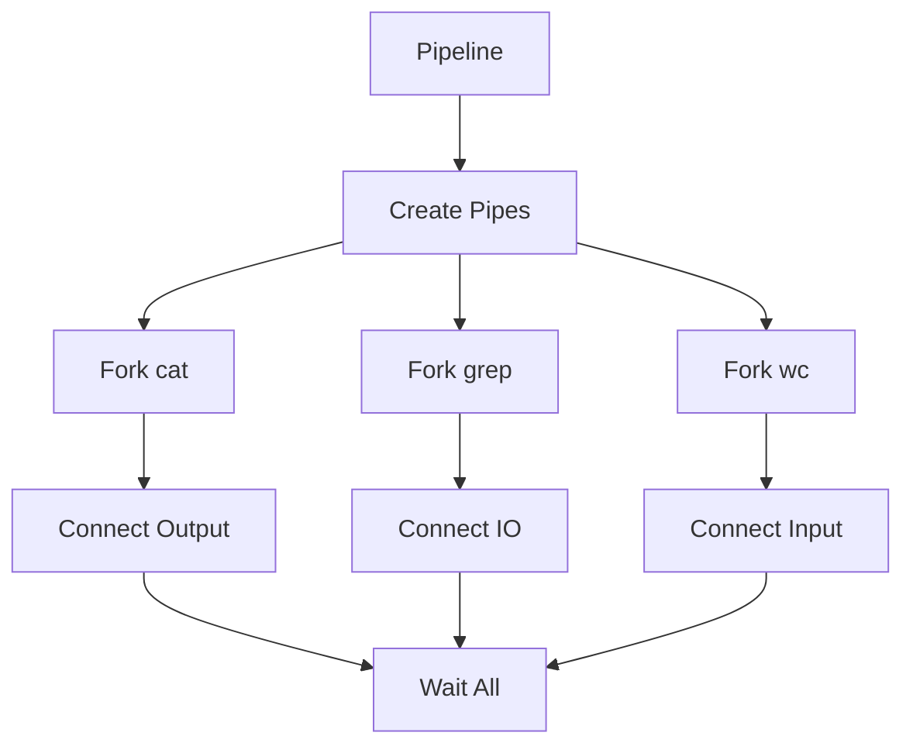

### Logical Operation
```bash
cmd1 && cmd2 || cmd3
```
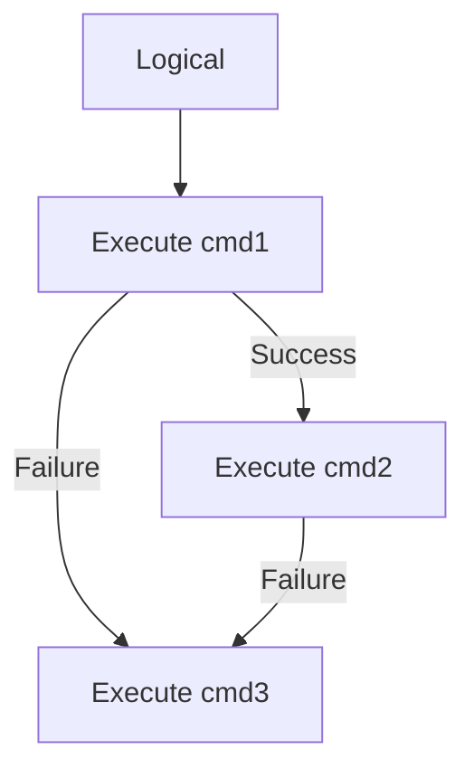

## Testing Strategy

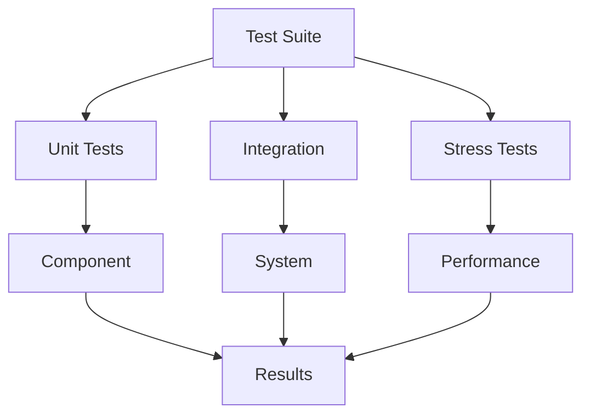

### Test Categories
1. Unit Testing
   - Component functions
   - Helper utilities
   - Error handlers
   - Path resolvers

2. Integration Testing
   - Command chains
   - Pipeline sequences
   - Redirection combinations
   - Signal handling

3. Stress Testing
   - Long pipelines
   - Heavy I/O
   - Memory pressure
   - Process limits

## Security Considerations

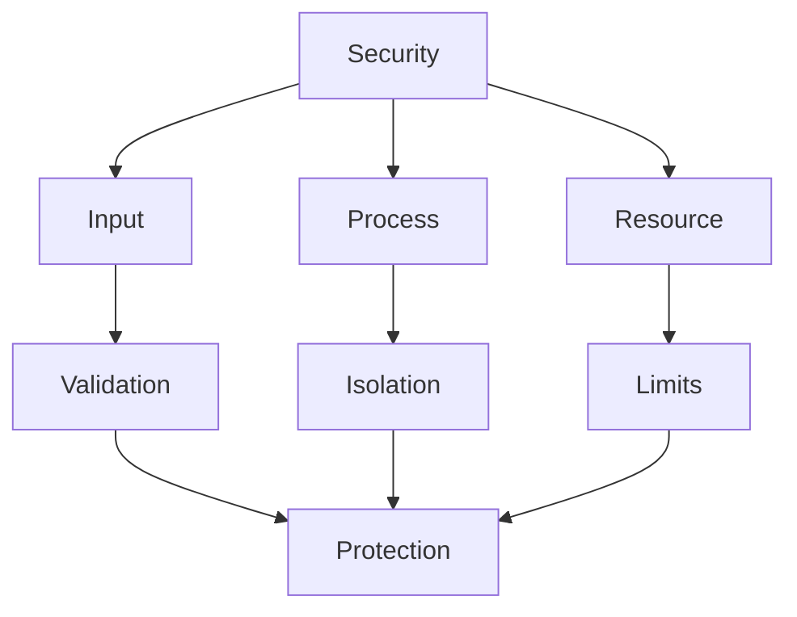

### Security Measures
1. Input Validation
   - Path sanitization
   - Command verification
   - Argument checking
   - Environment safety

2. Process Isolation
   - Clean forking
   - Group separation
   - Signal management
   - State isolation

3. Resource Protection
   - FD limits
   - Memory bounds
   - Process quotas
   - Time constraints
