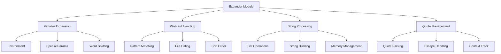

# Expander Module

## Architecture Overview



## Component Structure


### Main Components
1. `expander_core.c` - Core expansion functionality
2. `expansion_utils.c` - Basic expansion utilities
3. `variable_expansion.c` - Environment variable handling
4. `quote_handling.c` - Quote processing
5. `pattern_matching.c` - Pattern matching operations
6. `wildcard_expansion.c` - Wildcard handling
7. `path_expansion.c` - Path and tilde expansion
8. `string_lists.c` - String list core operations
9. `string_operations.c` - String transformations
10. `string_manipulation.c` - String content handling
11. `string_utils.c` - String utility functions

## Expansion Process Flow


## Variable Expansion System

```mermaid
graph TD
    A[Variable Token] --> B{Token Type}
    B -->|Basic $VAR| C[Direct Lookup]
    B -->|${VAR}| D[Brace Handler]
    B -->|Special| E[Special Param]
    
    C --> F[Env Check]
    D --> F
    E --> G[Value Fetch]
    
    F -->|Found| H[Value Process]
    F -->|Not Found| I[Empty String]
    
    H --> J[Word Split]
    I --> J
    G --> J
```

### Special Parameter Handling


## Wildcard Processing

```mermaid
graph TD
    A[Pattern] --> B[Parse Pattern]
    B --> C[Build Regex]
    C --> D[List Files]
    D --> E[Apply Pattern]
    E --> F[Sort Results]
    
    subgraph "Pattern Types"
        G[* Any]
        H[? Single]
        I[[] Class]
    end
```

### Pattern Matching Flow


## Quote Handling System


## String List Operations


## Error Handling System


## Example Expansions

### Environment Variables
```bash
# Basic expansion
echo $HOME           # /home/user

# Multiple variables
echo $USER@$HOSTNAME # user@host

# Special parameters
echo $?             # Last exit status
echo $$             # Shell PID

# Nested variables
echo ${PATH##*:}    # Last PATH entry
```

### Wildcard Patterns
```bash
# Basic matching
ls *.txt           # All .txt files

# Multiple patterns
ls *.[ch]          # All .c and .h files

# Hidden files
ls .*              # All hidden files

# Complex patterns
ls [a-z]*[0-9]     # Letter-start, number-end
```

### Tilde Expansion
```bash
# Home directory
cd ~               # Go to home
cd ~/Documents     # Go to Documents
cd ~user          # Go to user's home
```

## Performance Optimization


### Optimization Areas
1. Memory Management
   - String pooling
   - List node reuse
   - Buffer management
   - Smart allocation

2. Processing Speed
   - Pattern caching
   - Early termination
   - Result caching
   - Quick lookups

3. Resource Usage
   - Efficient file IO
   - Smart sorting
   - Minimal copying
   - State tracking

## Testing Framework


### Test Categories
1. Unit Testing
   - Variable expansion
   - Pattern matching
   - Quote handling
   - List operations

2. Integration Testing
   - Full expansions
   - Complex patterns
   - Error handling
   - Memory management

3. Performance Testing
   - Large directories
   - Complex patterns
   - Memory usage
   - Processing time

## Security Considerations


### Security Measures
1. Input Validation
   - Pattern safety
   - Path validation
   - Variable checks
   - Quote integrity

2. Access Control
   - Directory permissions
   - File access
   - Environment safety
   - User boundaries

3. Resource Protection
   - Memory limits
   - Pattern complexity
   - Expansion depth
   - Result size
