# Here-Document (Heredoc) Module

## Architecture Overview

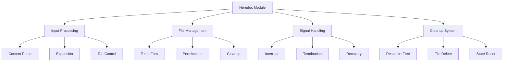

## Component Structure

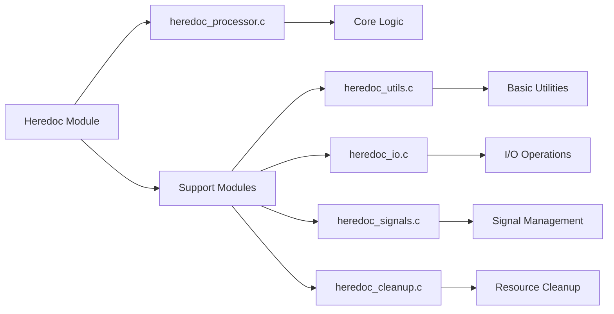

### Main Components
1. `heredoc_processor.c` - Core heredoc functionality and main processing loop
2. `heredoc_utils.c` - Utility functions and helper operations
3. `heredoc_io.c` - File I/O and input/output stream management
4. `heredoc_signals.c` - Signal handling and interrupt management
5. `heredoc_cleanup.c` - Resource cleanup and temporary file management

## Processing Pipeline

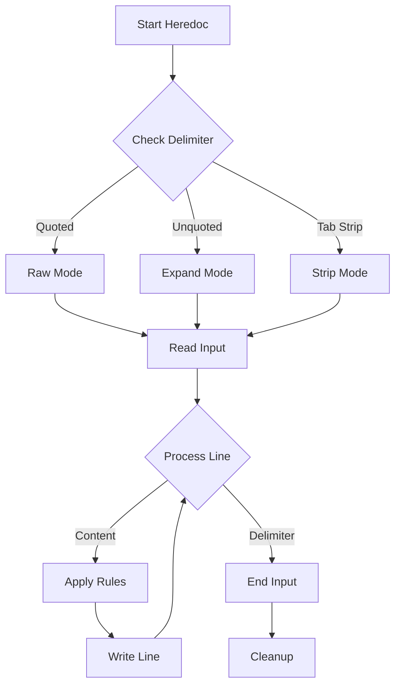

## Delimiter Processing

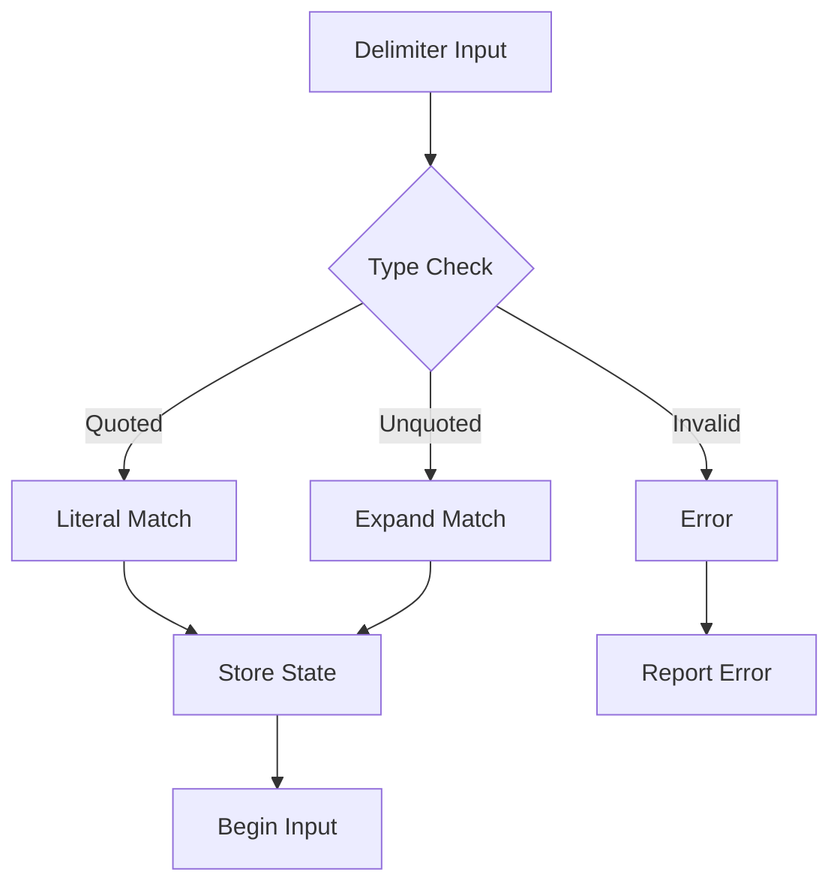

## Content Handling Flow

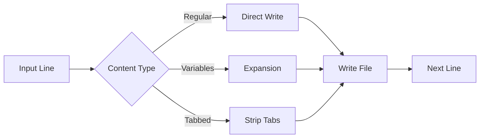

## File Management System

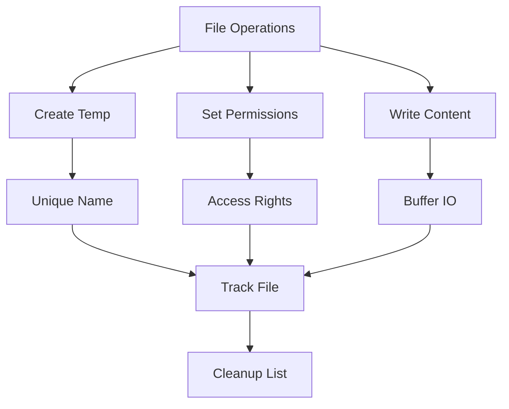

## Features and Usage

### Heredoc Types
```bash
# Basic heredoc
cat << EOF
content
EOF

# Tab-stripping heredoc
cat <<- EOF
    indented content
EOF

# Quoted delimiter (no expansion)
cat << 'EOF'
$HOME (not expanded)
EOF
```

## Signal Handling System

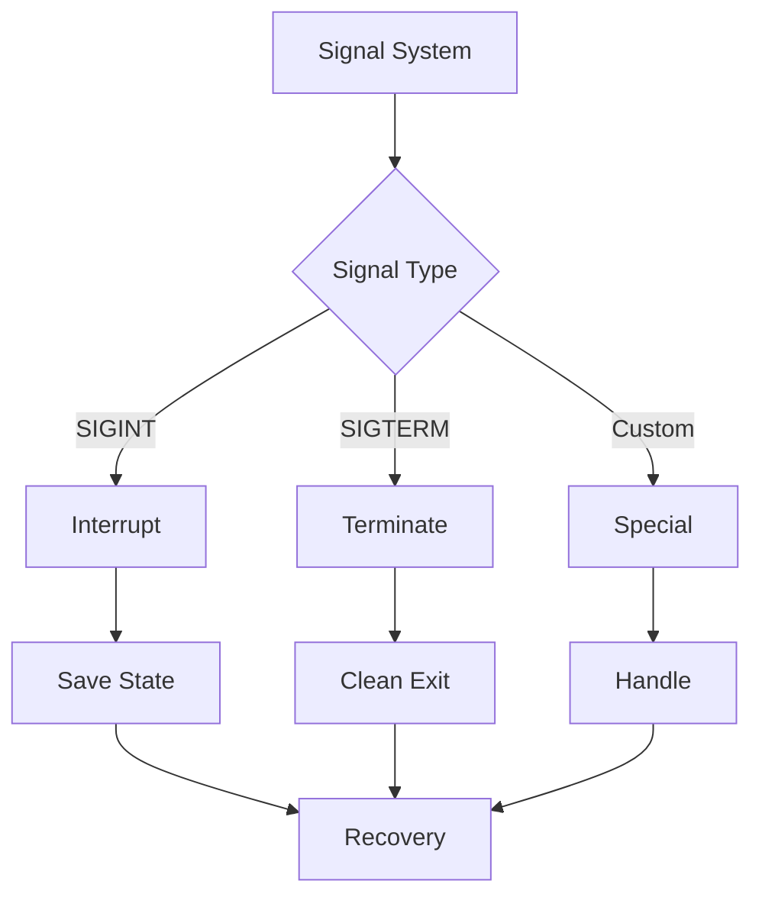

## Error Management

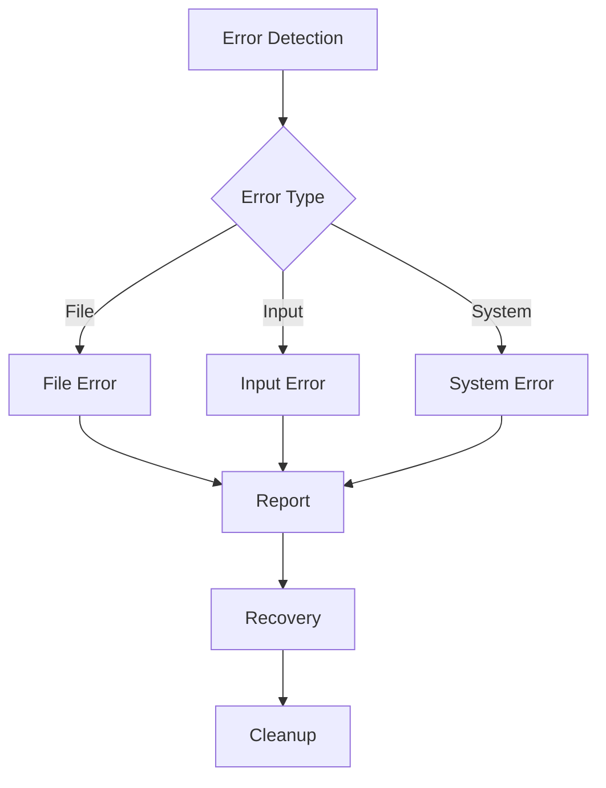

### Error Categories

1. **File Operations**
   - Creation failures
   - Permission denied
   - Disk space issues
   - Path validation
   - Cleanup errors

2. **Input Processing**
   - Premature EOF
   - Invalid content
   - Expansion errors
   - Format issues
   - Quote mismatches

3. **System Resources**
   - Memory limits
   - File descriptors
   - Process limits
   - Signal handling
   - State management

## Resource Management

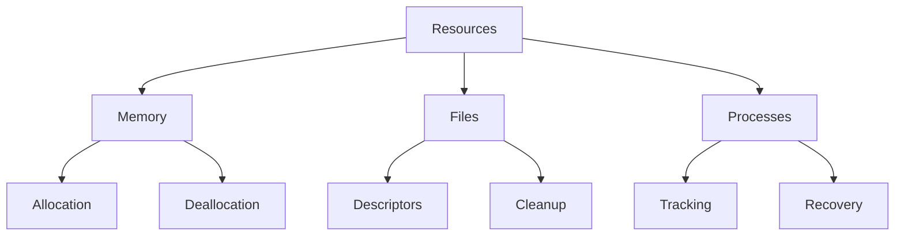

### Resource Optimization
1. Memory Management
   - Buffer optimization
   - String handling
   - State tracking
   - Cleanup routines

2. File Operations
   - Buffered I/O
   - Descriptor limits
   - Access patterns
   - Cleanup triggers

3. Process Control
   - Signal handling
   - State preservation
   - Recovery procedures
   - Resource limits

## Security Framework

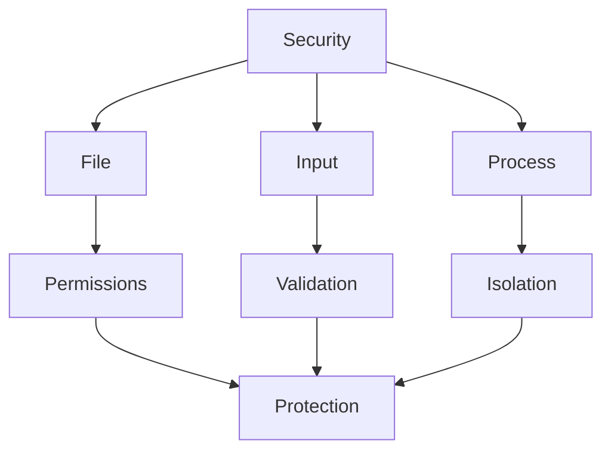

### Security Measures
1. File Security
   - Permission control
   - Path validation
   - Access limits
   - Cleanup verification

2. Input Protection
   - Content validation
   - Expansion safety
   - Quote handling
   - Size limits

3. Process Safety
   - Resource limits
   - Signal handling
   - State isolation
   - Recovery procedures

## Testing Framework

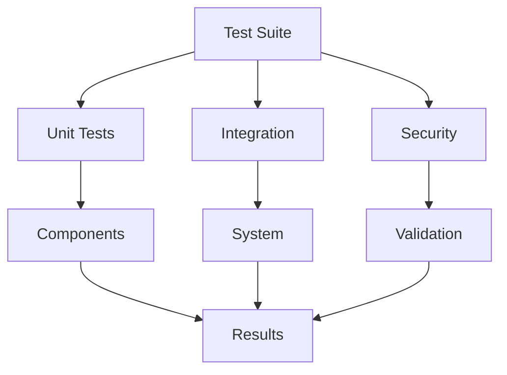

### Test Categories
1. Unit Testing
   - Component functions
   - Error handling
   - State management
   - Resource usage

2. Integration Testing
   - Shell interaction
   - Signal handling
   - File operations
   - Process control

3. Security Testing
   - Permission checks
   - Input validation
   - Resource limits
   - Cleanup verification

## Integration Points

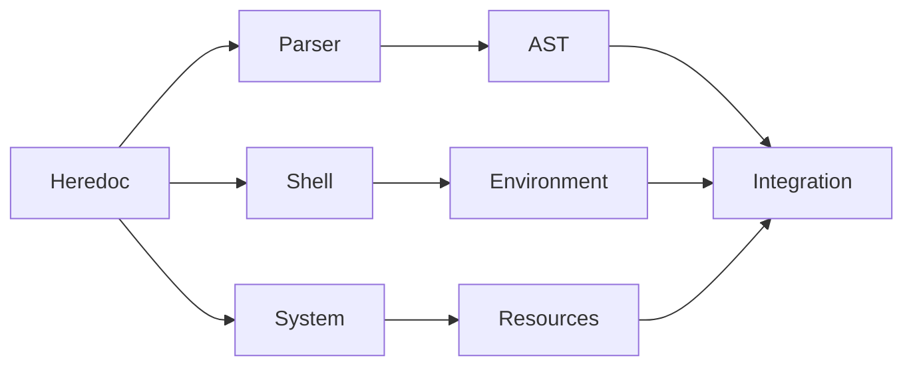

### Integration Areas
1. Parser Integration
   - Token processing
   - AST building
   - State management
   - Error handling

2. Shell Integration
   - Environment access
   - Signal management
   - Resource control
   - Status tracking

3. System Integration
   - File operations
   - Process control
   - Resource management
   - Security enforcement
