# Lexer Module

## Architecture Overview

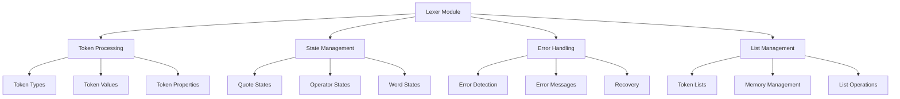

## Component Structure

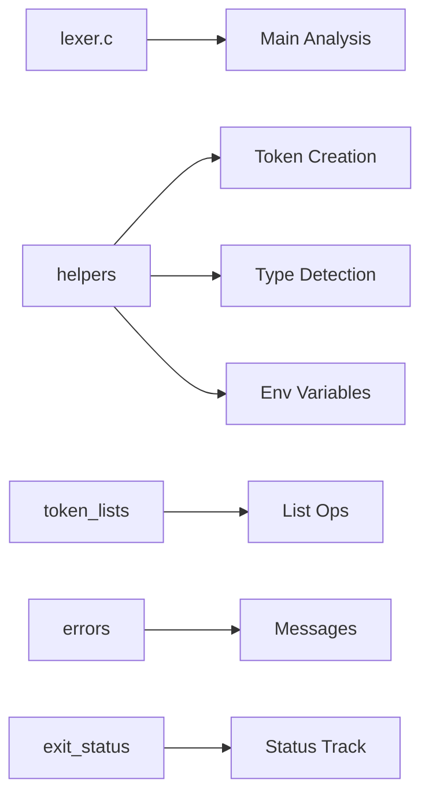

### Main Components
1. `lexer_core.c` - Main lexical analysis functionality
2. `token_creation.c` - Token creation and initialization
3. `token_analyzer.c` - Token type identification
4. `token_validation.c` - Token validation
5. `token_manipulation.c` - Token list operations
6. `errors/` - Error handling and messages
7. `exit_status/` - Exit status management

## Token Processing Flow

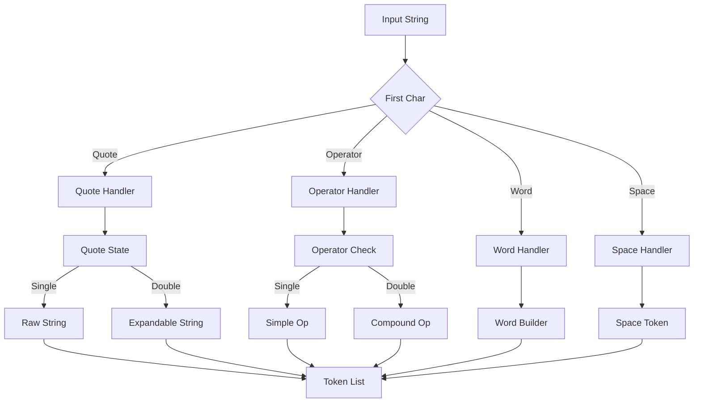

## Token Types and States

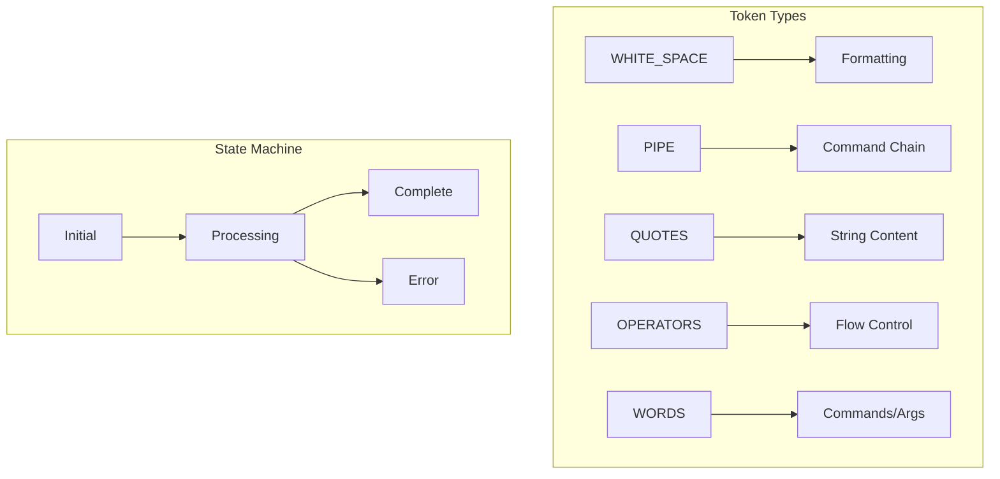

### Token Type Definitions
```c
enum t_token_type {
    WHITE_SPACE,    // Spaces, tabs, etc.
    PIPE,           // |
    OR,             // ||
    STR,            // Single-quoted string
    DQSTR,          // Double-quoted string
    INPUT,          // <
    OUTPUT,         // >
    APPEND,         // >>
    HEREDOC,        // <<
    HEREDOC_TAB,    // <<-
    WORD,           // Regular words/commands
    AND,            // &&
    LPREN,          // (
    RPREN,          // )
    NEW_LINE        // End of command
}
```

## Quote Handling System

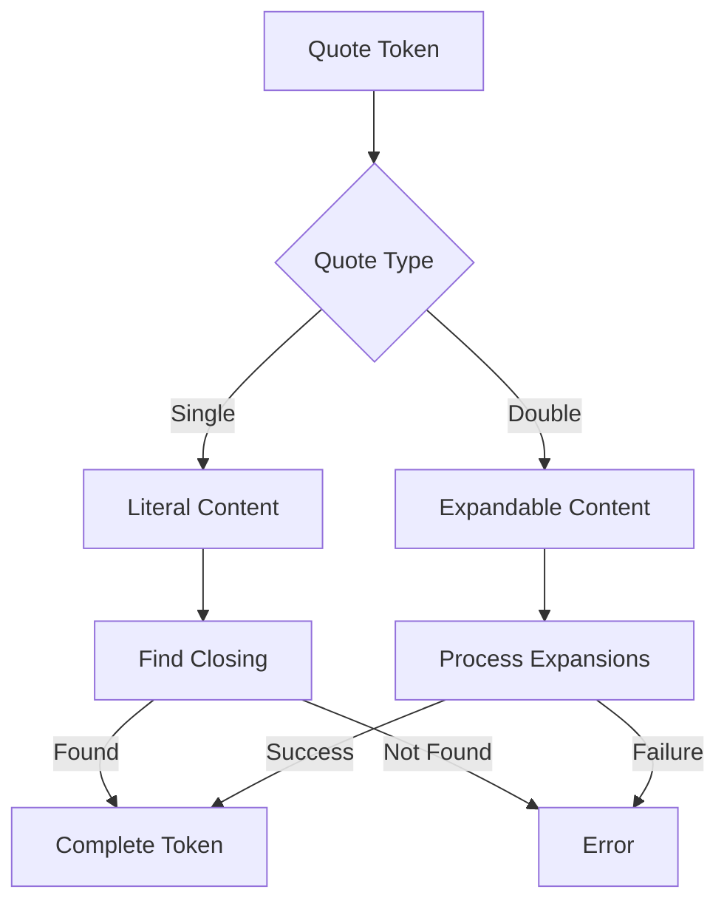

## Operator Processing

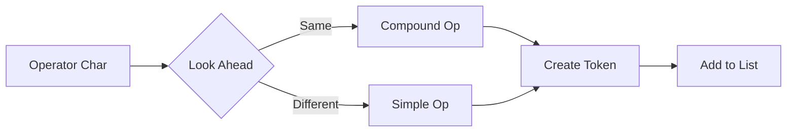

## Word Building Process

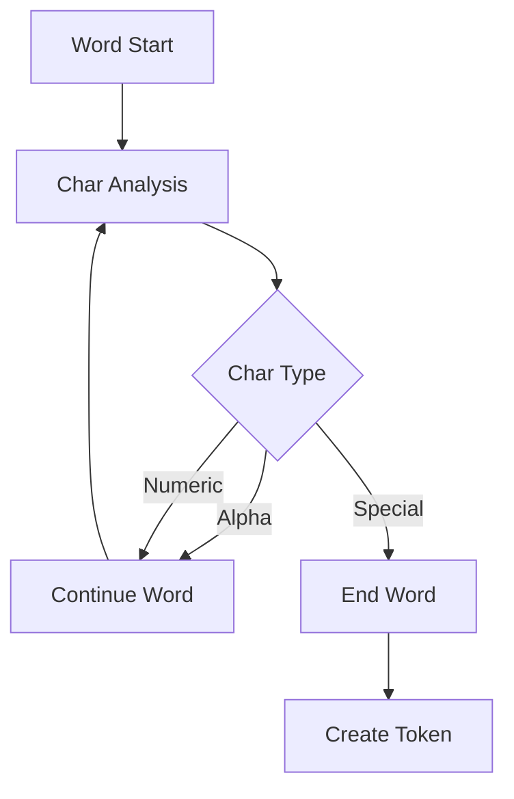

## Error Handling System

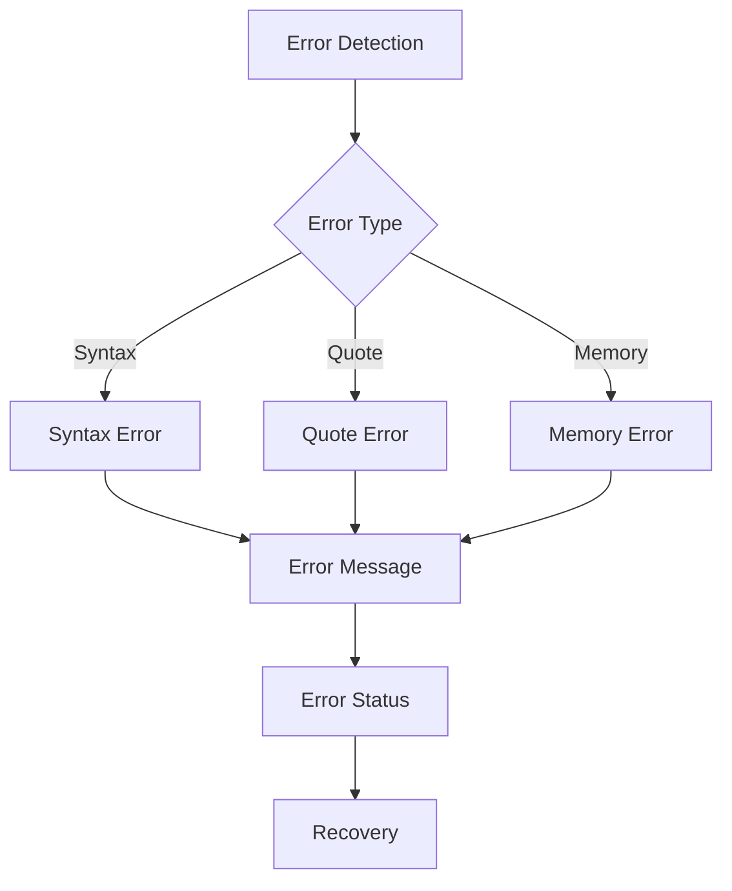

## Example Token Sequences

### Simple Command
```bash
echo "Hello World"
```


### Complex Pipeline
```bash
cat file.txt | grep "pattern" > output.txt
```
```mermaid
graph LR
    A[WORD:cat] --> B[WHITE_SPACE]
    B --> C[WORD:file.txt]
    C --> D[WHITE_SPACE]
    D --> E[PIPE]
    E --> F[WHITE_SPACE]
    F --> G[WORD:grep]
    G --> H[WHITE_SPACE]
    H --> I[DQSTR:pattern]
    I --> J[WHITE_SPACE]
    J --> K[OUTPUT]
    K --> L[WHITE_SPACE]
    L --> M[WORD:output.txt]
```

## Performance Optimization

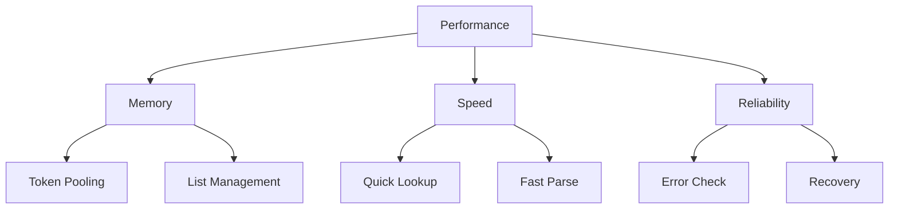

### Optimization Strategies
1. Memory Management
   - Token reuse
   - Efficient allocation
   - Smart deallocation
   - Buffer management

2. Processing Speed
   - Single-pass tokenization
   - Quick character classification
   - Efficient string operations
   - State optimization

3. Error Recovery
   - Early detection
   - Precise reporting
   - Graceful handling
   - Clean recovery

## Testing Framework

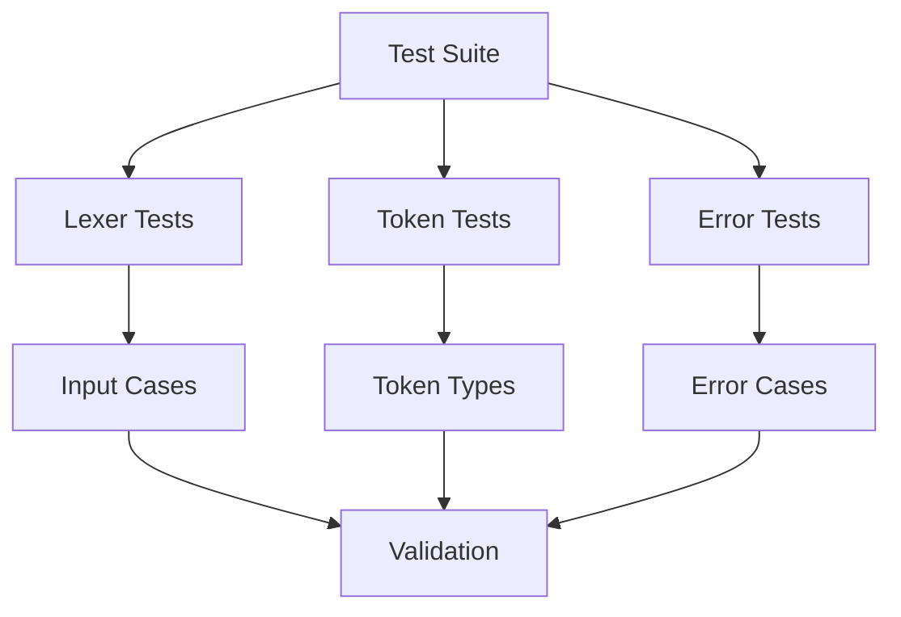

### Test Categories
1. Token Processing
   - Quote handling
   - Operator recognition
   - Word building
   - Space handling

2. Error Detection
   - Invalid syntax
   - Unclosed quotes
   - Memory errors
   - Recovery cases

3. Integration
   - Parser interaction
   - Memory management
   - State handling
   - List operations

## Security Considerations

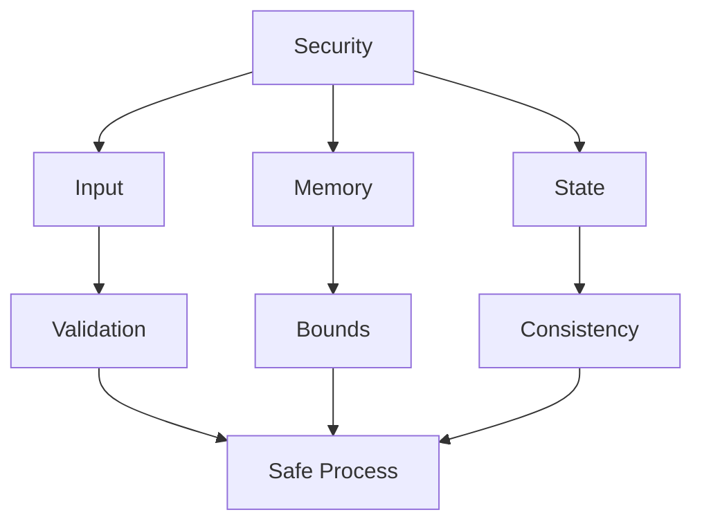

### Security Measures
1. Input Validation
   - Character safety
   - Length limits
   - Quote balance
   - Operator validity

2. Memory Protection
   - Allocation limits
   - Buffer checks
   - Cleanup routines
   - Error recovery

3. State Protection
   - Consistent states
   - Safe transitions
   - Error states
   - Recovery paths
