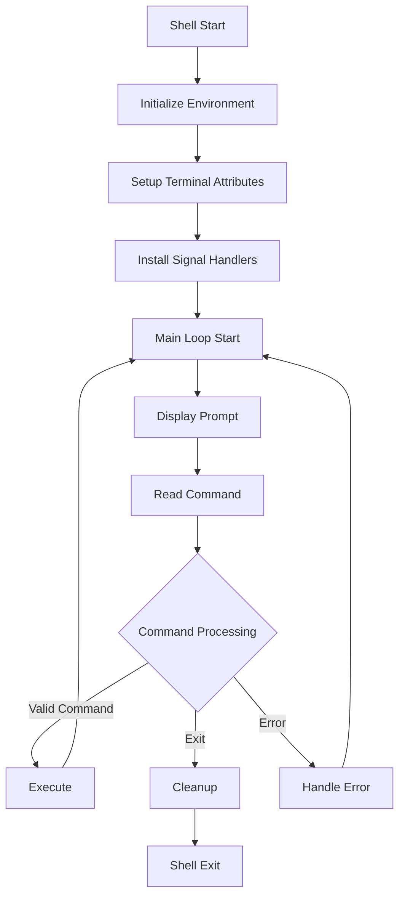

# Main Module

## Overview
The main module serves as the entry point and core orchestrator of the shell. It manages the shell's initialization, prompt customization, terminal attributes, signal handling, and the main execution loop. This module ties together all other components of the shell to create a cohesive interactive command-line interface.

## Components

### Core Files
1. `main.c` - Shell initialization and main loop
2. `prompt.c` - Prompt customization and formatting

## Features

### 1. Shell Initialization
- Environment setup
- Terminal attribute configuration
- Signal handler installation
- Working directory initialization
- History management

### 2. Interactive Prompt
```bash
┌──(username㉿hostname)-[~/current/path]
└─$ 
```
- Custom prompt with username and hostname
- Current directory display with home path shortening (~)
- Color-coded components for better readability
- System information integration

## Flow Diagram


## Implementation Details

### 1. Terminal Management
- Custom terminal attributes
- ECHOCTL flag management
- Signal catching configuration
- TTY state preservation

### 2. Command Processing
- Input reading with readline
- Command history management
- Signal state tracking
- Error handling and recovery

### 3. Prompt Customization
- Username detection
- Hostname resolution
- Path formatting
- Color coding
- Dynamic updates

## Edge Cases Handled

1. **Terminal States**
   - TTY attribute preservation
   - Signal interruption recovery
   - Non-interactive mode
   - Terminal reset

2. **User Information**
   - Missing username
   - Undefined hostname
   - Permission issues
   - Environment variables

3. **Path Handling**
   - Home directory resolution
   - Unknown current directory
   - Long paths
   - Special characters

4. **Input Processing**
   - Empty commands
   - Signal interruption
   - EOF handling
   - History management

## Error Handling

1. **Initialization Errors**
   - Environment setup failures
   - Terminal configuration issues
   - Permission problems
   - Resource allocation

2. **Runtime Errors**
   - Command processing failures
   - Signal handling issues
   - Memory allocation
   - File descriptor management

## Integration Points

1. **Component Integration**
   - Lexer initialization
   - Parser integration
   - Executor connection
   - Environment management

2. **System Integration**
   - Terminal management
   - Signal handling
   - Process control
   - File system interaction

## Performance Considerations

1. **Memory Management**
   - History allocation
   - Command line buffers
   - System information caching
   - Resource cleanup

2. **Terminal Operations**
   - Attribute caching
   - Prompt optimization
   - Signal handling efficiency
   - State management

## Security Considerations

1. **User Information**
   - Permission validation
   - Path sanitization
   - Environment verification
   - Input validation

2. **System Access**
   - File permissions
   - Terminal security
   - Signal restrictions
   - Resource limits 