# Parser Module

## Architecture Overview

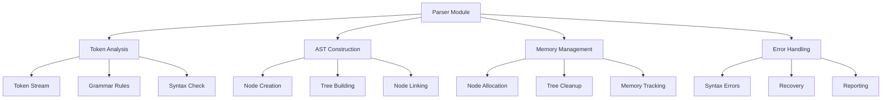

## Component Structure

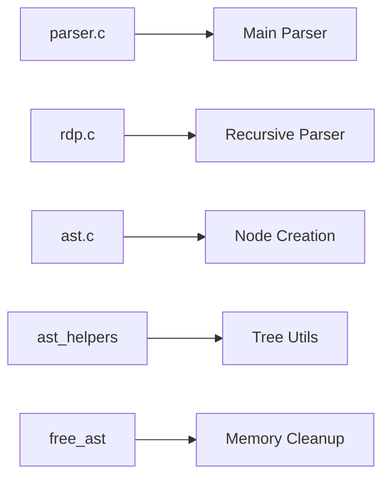

### Main Components
1. `parser_core.c` - Main parsing entry point
2. `recursive_descent_parser.c` - Recursive descent implementation
3. `ast_builder.c` - AST node creation
4. `ast_node_operations.c` - AST node management
5. `ast_validation.c` - AST validation and checking
6. `ast_cleanup.c` - AST memory management

## Parsing Process Flow

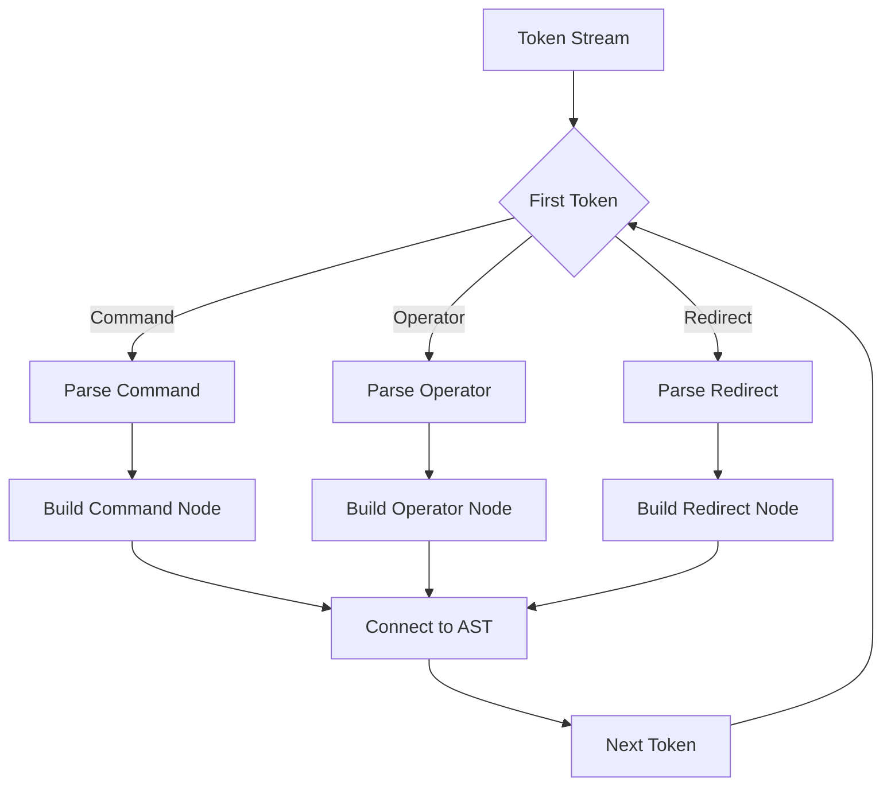

## AST Node Types and Structure

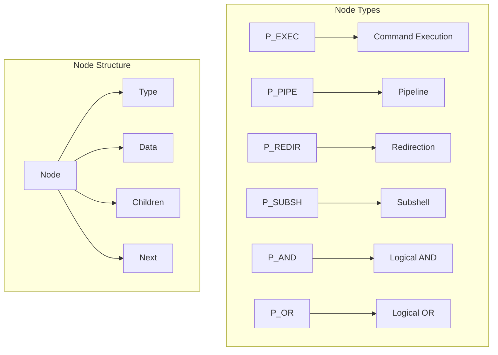

### Node Type Definitions
```c
enum t_node_type {
    P_EXEC,     // Command execution
    P_PIPE,     // Pipe operator
    P_REDIR,    // Redirection
    P_SUBSH,    // Subshell
    P_AND,      // Logical AND
    P_OR        // Logical OR
};
```

## Grammar Rules and Parsing

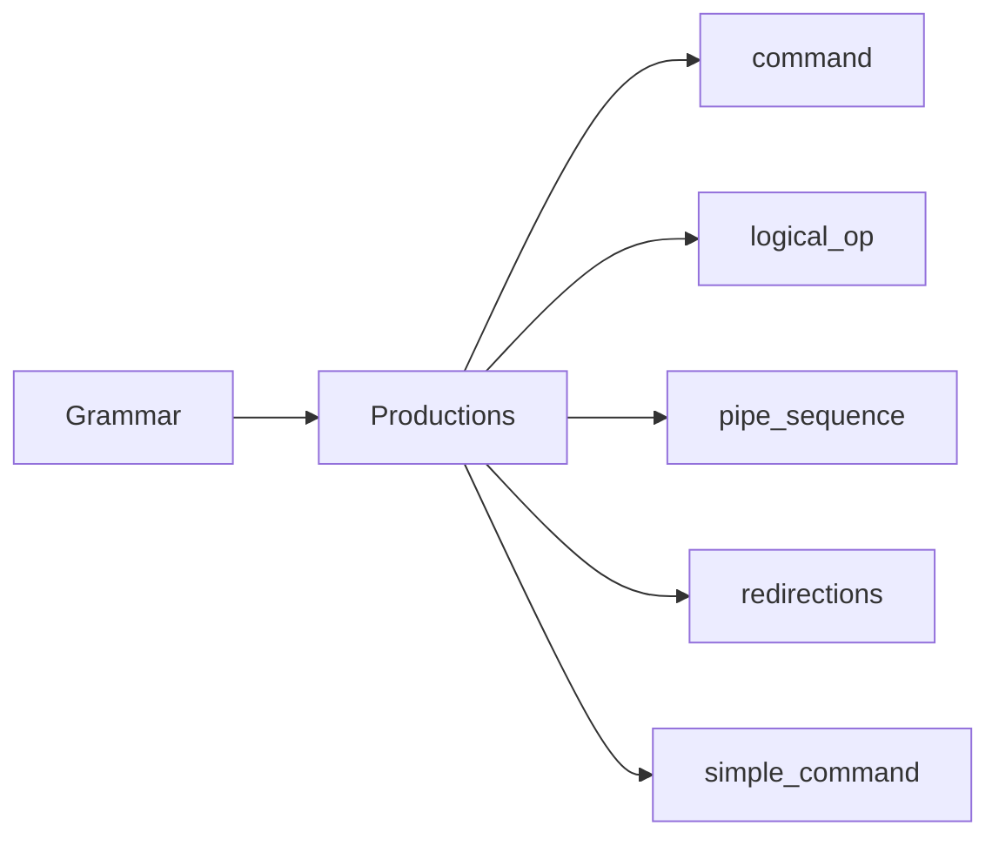

### EBNF Grammar
```ebnf
command     → logical_op
logical_op  → pipe_sequence ((AND | OR) pipe_sequence)*
pipe_sequence → redirections (PIPE redirections)*
redirections → (subshell | simple_command) redirection*
subshell    → LPREN command RPREN
simple_command → (WORD | QUOTED_STRING)+
redirection → (> | >> | < | << | <<-) WORD
```

## Command Structure Processing

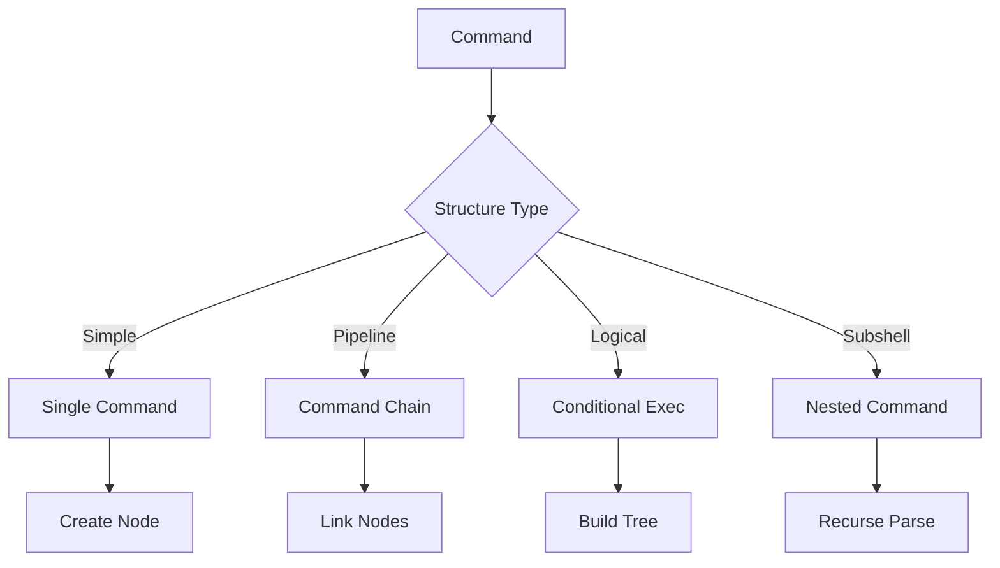

## Redirection Handling

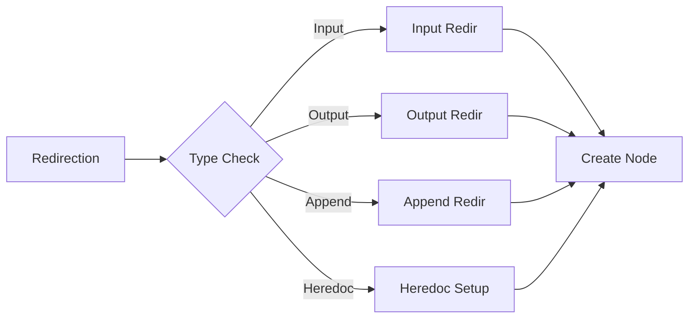

## AST Construction Process

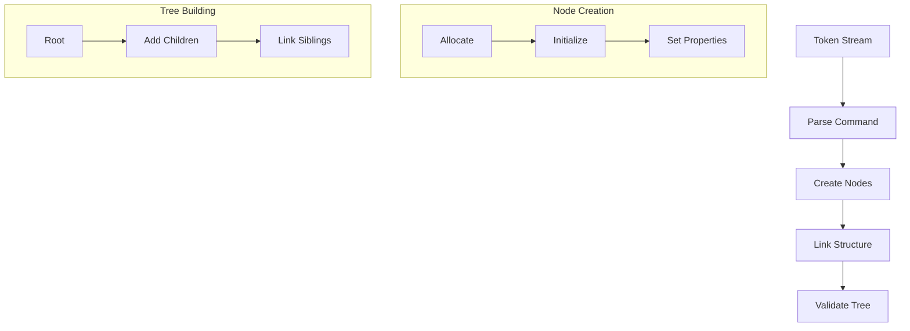

## Example AST Structures

### Simple Command
```bash
echo "Hello World"
```
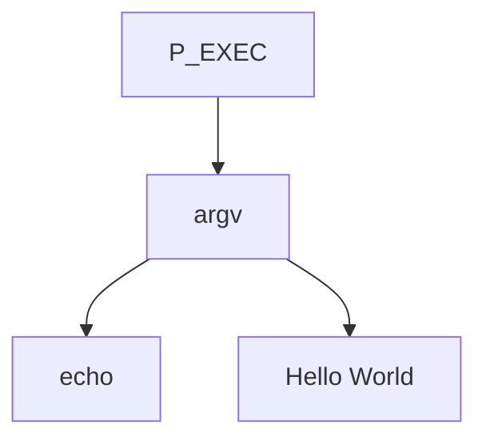

### Pipeline
```bash
ls -l | grep "pattern" | wc -l
```
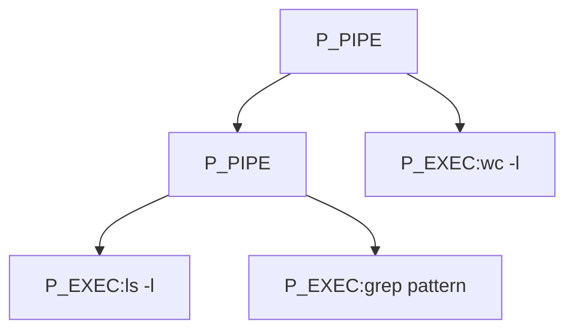

### Logical Operations
```bash
cmd1 && cmd2 || cmd3
```
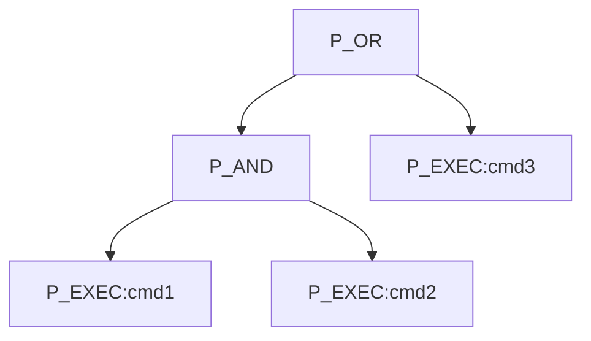

## Error Handling System

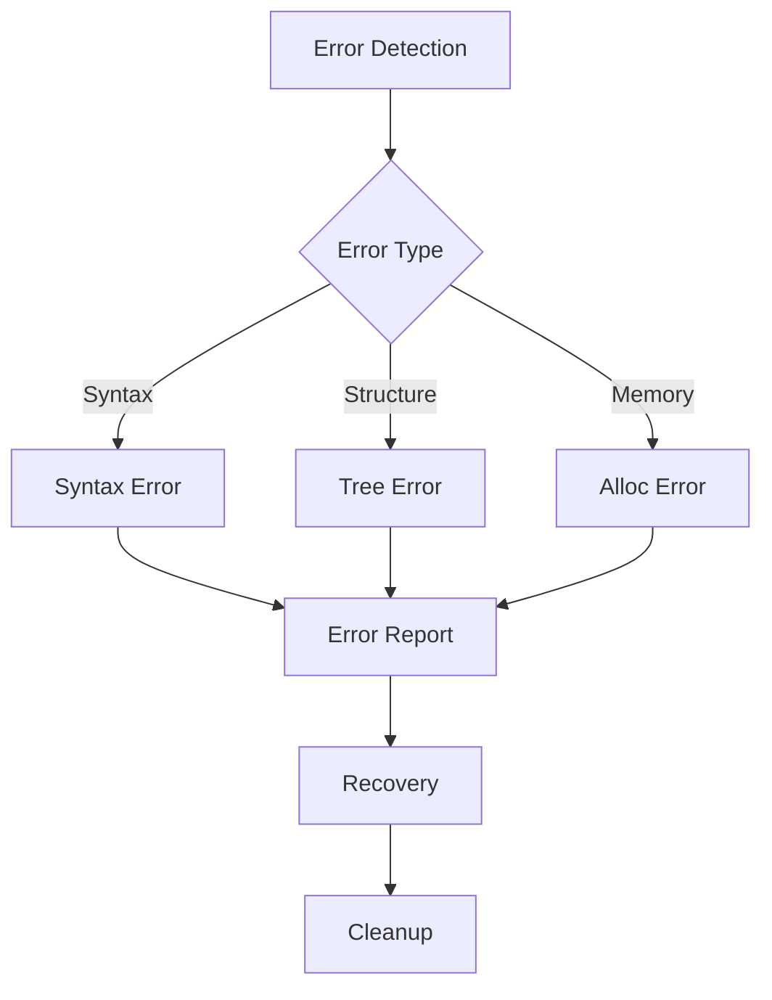

## Memory Management Flow

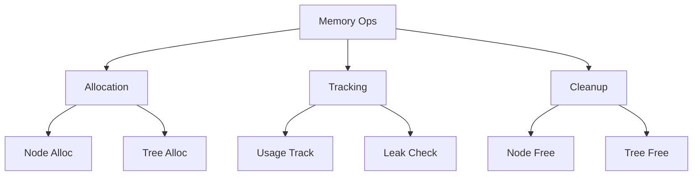

### Memory Management Strategies
1. Node Allocation
   - Efficient node creation
   - Property initialization
   - Children allocation
   - Link management

2. Tree Management
   - Structured growth
   - Balance maintenance
   - Connection tracking
   - Cleanup preparation

3. Memory Recovery
   - Recursive cleanup
   - Complete freeing
   - Pointer nulling
   - State restoration

## Testing Framework

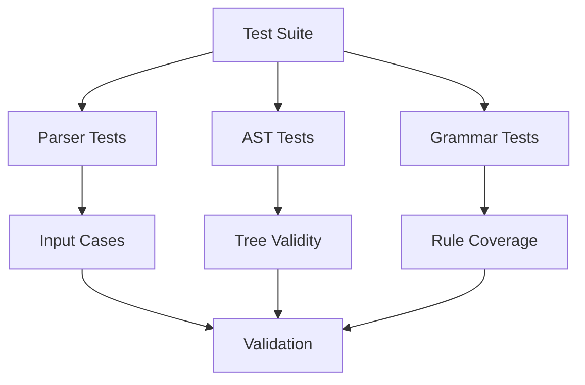

### Test Categories
1. Parser Testing
   - Token handling
   - Grammar rules
   - Error detection
   - Recovery methods

2. AST Testing
   - Node creation
   - Tree building
   - Property setting
   - Memory usage

3. Integration
   - Lexer interface
   - Executor handoff
   - Memory management
   - Error propagation

## Security Considerations

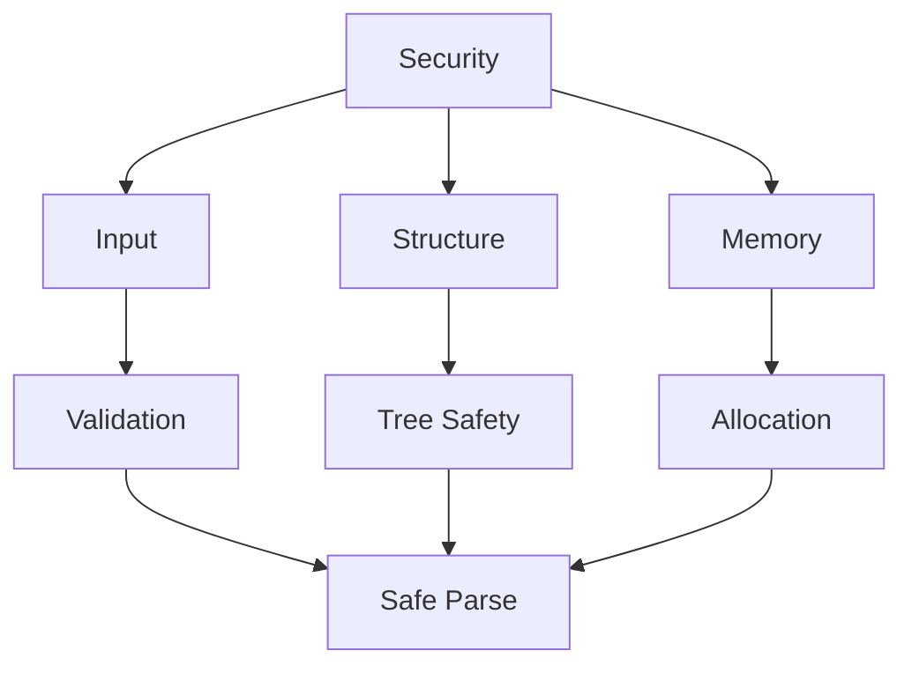

### Security Measures
1. Input Validation
   - Token verification
   - Structure checking
   - Depth limits
   - Size constraints

2. Tree Protection
   - Node validation
   - Link verification
   - Cycle prevention
   - Depth control

3. Resource Safety
   - Memory limits
   - Stack protection
   - Cleanup guarantee
   - Error handling
