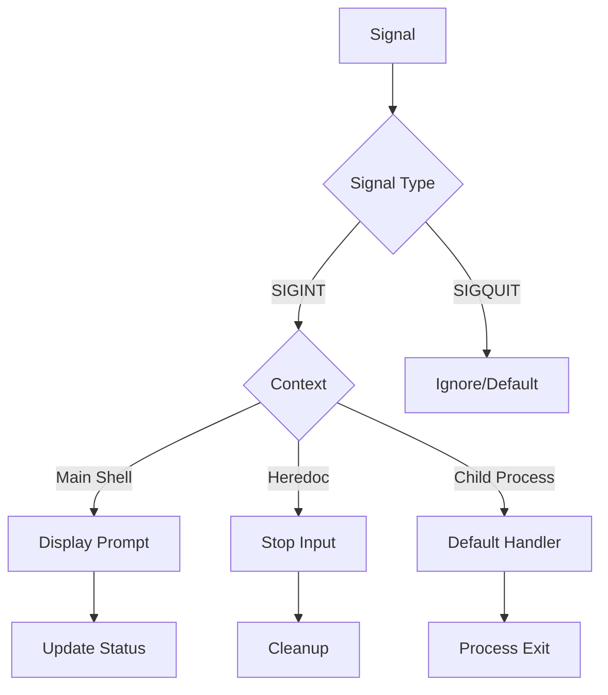

# Signal Handling Module

## Overview
The signal handling module manages shell signal behavior, including interactive signals (SIGINT, SIGQUIT) and their handling in different contexts like the main shell, heredocs, and child processes.

## Components

### Main Components
1. `signal_handler.c` - Signal handling implementation
   - Main signal handlers
   - Heredoc-specific handlers
   - Signal state management

## Signal Types

### 1. Interactive Signals
```c
SIGINT  (Ctrl+C)   // Interrupt signal
SIGQUIT (Ctrl+\)   // Quit signal
```

### 2. Signal States
```c
SET     // Install custom handlers
RESET   // Restore default handlers
```

## Flow Diagram


## Features

### 1. Signal Handling
```c
// Main shell handling
sigint_handler()      // Handle Ctrl+C
SIG_IGN              // Ignore Ctrl+\

// Heredoc handling
heredoc_sigint_handler()  // Handle Ctrl+C in heredoc
```

### 2. Signal Management
```c
install_default_sig_handlers()   // Set up handlers
reset_default_sig_handlers()     // Restore defaults
```

## Edge Cases Handled

1. **Interactive Mode**
   - Prompt display
   - Line clearing
   - History preservation
   - Cursor positioning
   - Status updating

2. **Heredoc Mode**
   - Input termination
   - Buffer cleanup
   - State restoration
   - File descriptor handling
   - Signal reset

3. **Child Processes**
   - Signal inheritance
   - Default behavior
   - Status propagation
   - Process group handling
   - Zombie prevention

4. **Signal States**
   - Handler installation
   - State restoration
   - Context preservation
   - Race conditions
   - Signal masking

## Example Behavior

1. **Main Shell**
```bash
$ long_running_command
^C              # Displays new prompt
$ 
```

2. **Heredoc**
```bash
$ cat << EOF
> heredoc_content
^C              # Terminates heredoc
$ 
```

3. **Child Process**
```bash
$ sleep 100
^C              # Terminates sleep
$ 
```

## Integration Points

1. **Shell Integration**
   - Readline library
   - Terminal control
   - Process management
   - Status handling

2. **Process Control**
   - Child processes
   - Process groups
   - Terminal control
   - Exit status

## Error Handling

1. **Signal Errors**
   - Handler installation
   - System calls
   - Resource cleanup
   - State recovery

2. **Process Errors**
   - Termination handling
   - Status collection
   - Resource cleanup
   - Orphan prevention

## Performance Considerations

1. **Signal Safety**
   - Async-signal-safe functions
   - Minimal handler work
   - State preservation
   - Race prevention

2. **Resource Management**
   - File descriptor handling
   - Memory cleanup
   - Process cleanup
   - State restoration

## Implementation Details

1. **Signal Handlers**
   - SIGINT handling
   - SIGQUIT handling
   - Context awareness
   - State management

2. **Process Control**
   - Process groups
   - Terminal control
   - Status management
   - Resource cleanup

3. **Terminal Management**
   - Line editing
   - Prompt display
   - Cursor control
   - Buffer management

## Security Considerations

1. **Signal Safety**
   - Handler restrictions
   - Resource protection
   - State consistency
   - Privilege handling

2. **Process Security**
   - Group management
   - Terminal ownership
   - Resource isolation
   - Permission handling 